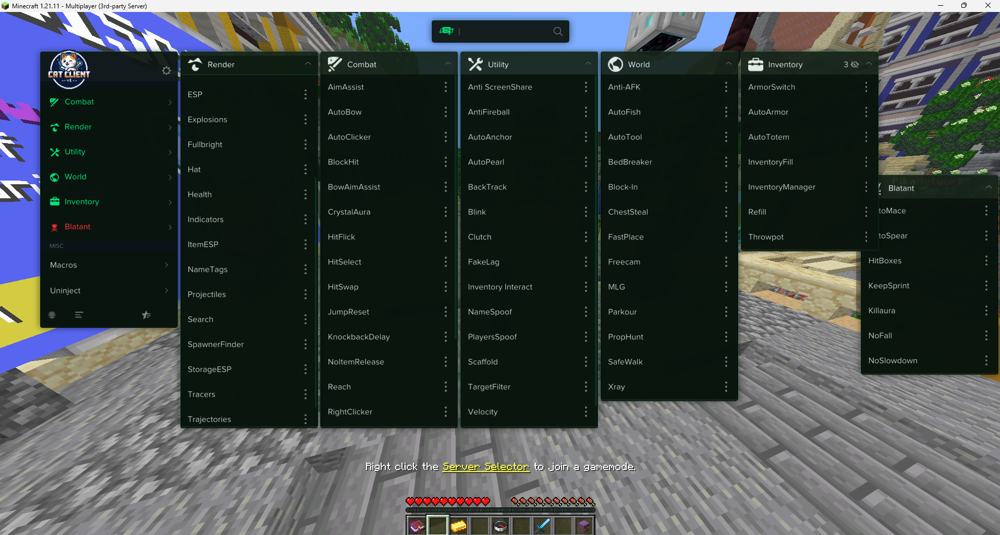
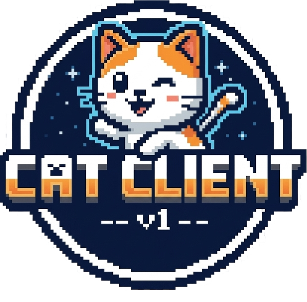

# 🐱 CatClient

**CatClient** is a free injectable Minecraft client that adds various features to enhance your gameplay experience.

It works on Minecraft versions from **1.7.10 up to 1.21.11** and supports **Vanilla**, **Forge**, and **Fabric**.

---

## how it looked last time i used it(it could still look same tho i dont know):
# 🖼️ Preview

## 📦 Features

- **Injector-based** - Injects directly into Minecraft
- **Wide Version Support** - Works on 30+ Minecraft versions
- **Multi-Platform** - Supports Vanilla, Forge, and Fabric
- **Discord RPC** - Shows your status on Discord while playing
- **Custom Icons** - Unique icons for different features
- **Launcher Support** - Works on Vanilla Launcher and other clients
- **Auto-Updater** - Keeps the client up to date
- **Key System** - Simple key validation with 7 days limit(per key)

---

## 🔧 How It Works

1. Download the injector
2. Get your key from the website
3. Run the injector and enter your key
4. The injector will detect Minecraft and inject

More features are currently being worked on.

---

## 🖥️ Launcher Compatibility

| Launcher | Status |
|----------|--------|
| Vanilla Launcher | ✅ |
| Badlion Client | ✅ |
| Lunar Client | Probably yes |

---

## 🔒 Security

The client uses:
- CAPTCHA protection for key validation
- Rate limiting to prevent abuse
- HWID binding to prevent key sharing

---

## ⚠️ Disclaimer

This client is for educational purposes only . Use it only on servers where client-side modifications are allowed. The developer IS NOT responsible for any bans or issues caused by misuse.

---

## 🌐 Official links(only)

- **Website**: [catclient.catclient.workers.dev](https://catclient.catclient.workers.dev)
- **Discord**: [discord.gg/Wk5pYEMZrd](https://discord.gg/Wk5pYEMZrd)
- **Github**: [https://github.com/CatalingamingYT1/CatClient](https://github.com/CatalingamingYT1/CatClient)

---

## 📸 Logo :)

---

## 📝 Notes

- The client is completely free
- Discord RPC works but may need updating for newer Discord versions
- Some features are still in development

---

## **Made by Catalin**

